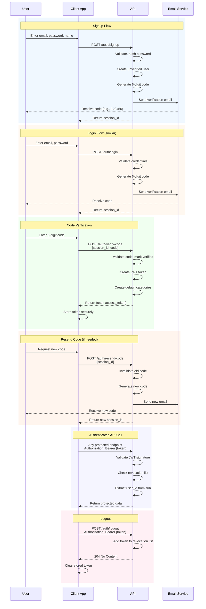

# FinTrack API Reference

**Base URL:** `http://localhost:8000/api/v1`  
**OpenAPI (Swagger) UI:** `http://localhost:8000/docs`  
**Health Check:** `GET /health`

---

## Table of Contents

- [Authentication](#authentication)
- [Authentication Flow Diagram](#authentication-flow-diagram)
- [Users](#users)
- [Transactions](#transactions)
- [Categories](#categories)
- [Budgets](#budgets)
- [Goals](#goals)
- [Development (Local Only)](#development-local-only)
- [Error Codes](#error-codes)
- [Rate Limiting](#rate-limiting)

---

## Authentication

### POST /auth/signup
Register a new user account. Sends a 6-digit verification code to the email.

**Rate Limit:** 5 requests per minute

| | |
|:---|:---|
| **Auth Required** | No |
| **Request Body** | `SignupRequest` |
| **Response** | `VerificationPendingResponse` |
| **Errors** | 400 (invalid input), 409 (email exists), 429 (rate limit), 500 (email failed) |

**Request Body (`SignupRequest`):**
```json
{
  "email": "user@example.com",      // required, valid email
  "password": "securepassword123", // required, 8-128 chars
  "name": "John Doe"               // optional
}
```

**Response (`VerificationPendingResponse`):**
```json
{
  "session_id": "uuid-session-id",
  "message": "Verification code sent to your email"
}
```

---

### POST /auth/login
Authenticate with email and password. Sends a 6-digit verification code.

**Rate Limit:** 5 requests per minute

| | |
|:---|:---|
| **Auth Required** | No |
| **Request Body** | `LoginRequest` |
| **Response** | `VerificationPendingResponse` |
| **Errors** | 400 (invalid input), 401 (invalid credentials), 429 (rate limit) |

**Request Body (`LoginRequest`):**
```json
{
  "email": "user@example.com",
  "password": "securepassword123"
}
```

---

### POST /auth/verify-code
Verify the 6-digit code and receive JWT tokens.

**Rate Limit:** 3 requests per minute

| | |
|:---|:---|
| **Auth Required** | No |
| **Request Body** | `VerifyCodeRequest` |
| **Response** | `AuthResponse` |
| **Errors** | 400 (invalid input), 401 (invalid code), 429 (rate limit), 500 (server error) |

**Request Body (`VerifyCodeRequest`):**
```json
{
  "session_id": "uuid-session-id",  // from signup/login
  "code": "123456"                   // 6-digit code
}
```

**Response (`AuthResponse`):**
```json
{
  "user": {
    "id": "uuid-user-id",
    "email": "user@example.com",
    "name": "John Doe",
    "avatar": "https://..."
  },
  "access_token": "eyJhbGciOiJIUzI1NiIs...",
  "refresh_token": null
}
```

**Token Details:**
- Algorithm: HS256
- Expiry: 60 minutes
- Payload: `sub` (user_id), `exp` (expiry), `jti` (unique token ID)

---

### POST /auth/resend-code
Request a new verification code for an existing session.

**Rate Limit:** 3 requests per minute

| | |
|:---|:---|
| **Auth Required** | No |
| **Request Body** | `ResendCodeRequest` |
| **Response** | `VerificationPendingResponse` |
| **Errors** | 400 (invalid input), 401 (invalid session), 429 (too many resends), 500 (email failed) |

**Request Body (`ResendCodeRequest`):**
```json
{
  "session_id": "uuid-session-id"
}
```

**Limits:**
- Maximum 3 resends per session
- Previous code is invalidated when resending
- Code expires after 10 minutes

---

### POST /auth/social
Authenticate via social provider (Google or Apple).

**Rate Limit:** 5 requests per minute

| | |
|:---|:---|
| **Auth Required** | No |
| **Request Body** | `SocialAuthRequest` |
| **Response** | `AuthResponse` (already verified) |
| **Errors** | 400 (invalid input), 401 (invalid token), 429 (rate limit) |

**Request Body (`SocialAuthRequest`):**
```json
{
  "provider": "google",      // or "apple"
  "id_token": "jwt-from-provider"
}
```

**Note:** Social auth returns tokens immediately without verification code step.

---

### GET /auth/me
Get current authenticated user profile.

**Rate Limit:** None

| | |
|:---|:---|
| **Auth Required** | Yes (Bearer token) |
| **Response** | `UserResponse` |
| **Errors** | 401 (unauthorized), 403 (token revoked) |

**Response (`UserResponse`):**
```json
{
  "id": "uuid-user-id",
  "email": "user@example.com",
  "name": "John Doe",
  "avatar": "https://..."
}
```

---

### POST /auth/logout
Revoke the current JWT token.

**Rate Limit:** None

| | |
|:---|:---|
| **Auth Required** | Yes (Bearer token) |
| **Response** | 204 No Content |
| **Errors** | 401 (unauthorized) |

**Note:** Token is added to revocation blocklist and cannot be reused.

---

## Authentication Flow Diagram



### Flow Summary

1. **Signup/Login** → Returns `session_id`, sends 6-digit code via email
2. **Verify Code** → Exchange `session_id` + code for JWT
3. **Authenticated Requests** → Include `Authorization: Bearer <token>` header
4. **Logout** → Token is revoked and cannot be reused

### Verification Code Rules

| Rule | Value |
|:---|:---|
| Code length | 6 digits |
| Expiry time | 10 minutes |
| Max resends per session | 3 |
| Max failed attempts | 5 (then rate limited) |

---

## Users

### GET /auth/me
See [Authentication section](#get-authme).

---

## Transactions

All endpoints require authentication (`Authorization: Bearer <token>`).

### GET /transactions
List transactions with filtering and pagination.

**Rate Limit:** None

| | |
|:---|:---|
| **Auth Required** | Yes |
| **Query Params** | See below |
| **Response** | `TransactionListResponse` |
| **Errors** | 401 (unauthorized), 400 (invalid params) |

**Query Parameters:**

| Parameter | Type | Description |
|:---|:---|:---|
| `type` | string | Filter by type: `"income"` or `"expense"` |
| `category_id` | string | Filter by category UUID |
| `date_from` | datetime | Start date (ISO 8601) |
| `date_to` | datetime | End date (ISO 8601) |
| `amount_min` | float | Minimum amount |
| `amount_max` | float | Maximum amount |
| `search` | string | Search in note/category (max 200 chars) |
| `page` | int | Page number (default: 1, max: 10000) |
| `page_size` | int | Items per page (default: 20, min: 1, max: 100) |

**Response (`TransactionListResponse`):**
```json
{
  "items": [
    {
      "id": "uuid-transaction-id",
      "type": "expense",
      "amount": 1500.00,
      "currency": "RUB",
      "category_id": "uuid-category-id",
      "category": "Food & Drinks",
      "note": "Grocery shopping",
      "date": "2025-01-15T10:30:00",
      "recurring": false
    }
  ],
  "total": 42,
  "page": 1,
  "page_size": 20,
  "has_more": true
}
```

---

### GET /transactions/{transaction_id}
Get a single transaction by ID.

**Rate Limit:** None

| | |
|:---|:---|
| **Auth Required** | Yes |
| **Path Param** | `transaction_id` (UUID) |
| **Response** | `TransactionResponse` |
| **Errors** | 401 (unauthorized), 404 (not found) |

---

### POST /transactions
Create a new transaction.

**Rate Limit:** None

| | |
|:---|:---|
| **Auth Required** | Yes |
| **Request Body** | `TransactionCreate` |
| **Response** | `TransactionResponse` (201 Created) |
| **Errors** | 400 (invalid input), 401 (unauthorized), 404 (category not found) |

**Request Body (`TransactionCreate`):**
```json
{
  "type": "expense",              // required: "income" or "expense"
  "amount": 1500.00,              // required: positive number
  "currency": "RUB",              // required: 3-letter code
  "category_id": "uuid-category", // required: valid category ID
  "note": "Grocery shopping",     // optional: max 500 chars
  "date": "2025-01-15T10:30:00",  // required: ISO 8601 datetime
  "recurring": false              // optional: default false
}
```

**Note:** Amounts are stored in RUB. Frontend handles currency conversion before sending.

---

### PUT /transactions/{transaction_id}
Update an existing transaction.

**Rate Limit:** None

| | |
|:---|:---|
| **Auth Required** | Yes |
| **Path Param** | `transaction_id` (UUID) |
| **Request Body** | `TransactionUpdate` |
| **Response** | `TransactionResponse` |
| **Errors** | 400 (invalid input), 401 (unauthorized), 404 (not found) |

**Request Body (`TransactionUpdate`):** Same as `TransactionCreate` but all fields optional.

---

### DELETE /transactions/{transaction_id}
Delete a transaction.

**Rate Limit:** None

| | |
|:---|:---|
| **Auth Required** | Yes |
| **Path Param** | `transaction_id` (UUID) |
| **Response** | 204 No Content |
| **Errors** | 401 (unauthorized), 404 (not found) |

---

### GET /transactions/stats
Get monthly statistics including totals, category breakdown, and daily breakdown.

**Rate Limit:** None

| | |
|:---|:---|
| **Auth Required** | Yes |
| **Query Param** | `month` (format: `YYYY-MM`) |
| **Response** | `StatsResponse` |
| **Errors** | 400 (invalid month format), 401 (unauthorized) |

**Query Parameters:**

| Parameter | Type | Description |
|:---|:---|:---|
| `month` | string | Format: `YYYY-MM`, defaults to current month |

**Response (`StatsResponse`):**
```json
{
  "total_income": 50000.00,
  "total_expenses": 32500.00,
  "balance": 17500.00,
  "by_category": [
    {
      "category": "Food & Drinks",
      "amount": 8500.00,
      "percentage": 26.2,
      "color": "#F59E0B"
    }
  ],
  "daily": [
    {
      "date": "2025-01-01",
      "income": 0,
      "expense": 1200.00
    }
  ]
}
```

---

## Categories

All endpoints require authentication.

### GET /categories
List all categories for the authenticated user.

**Rate Limit:** None

| | |
|:---|:---|
| **Auth Required** | Yes |
| **Response** | `CategoryResponse[]` |
| **Errors** | 401 (unauthorized) |

**Response:**
```json
[
  {
    "id": "uuid-category-id",
    "name": "Food & Drinks",
    "icon": "restaurant",
    "color": "#F59E0B",
    "type": "expense"
  }
]
```

**Note:** 12 default categories are created on signup (e.g., Salary, Food & Drinks, Transport, etc.).

---

### POST /categories
Create a new category.

**Rate Limit:** None

| | |
|:---|:---|
| **Auth Required** | Yes |
| **Request Body** | `CategoryCreate` |
| **Response** | `CategoryResponse` (201 Created) |
| **Errors** | 400 (invalid input), 401 (unauthorized), 409 (duplicate name) |

**Request Body (`CategoryCreate`):**
```json
{
  "name": "Custom Category",  // required: 1-100 chars
  "icon": "custom-icon",    // required: 1-50 chars
  "color": "#FF5733",       // required: hex color
  "type": "expense"         // required: "income", "expense", or "both"
}
```

---

### PUT /categories/{category_id}
Update a category.

**Rate Limit:** None

| | |
|:---|:---|
| **Auth Required** | Yes |
| **Path Param** | `category_id` (UUID) |
| **Request Body** | `CategoryUpdate` |
| **Response** | `CategoryResponse` |
| **Errors** | 400 (invalid input), 401 (unauthorized), 404 (not found), 409 (duplicate name) |

---

### DELETE /categories/{category_id}
Delete a category.

**Rate Limit:** None

| | |
|:---|:---|
| **Auth Required** | Yes |
| **Path Param** | `category_id` (UUID) |
| **Response** | 204 No Content |
| **Errors** | 401 (unauthorized), 404 (not found), 409 (has transactions) |

**Note:** Categories with existing transactions cannot be deleted.

---

## Budgets

All endpoints require authentication.

### GET /budgets
List all budgets for the authenticated user.

**Rate Limit:** None

| | |
|:---|:---|
| **Auth Required** | Yes |
| **Response** | `BudgetResponse[]` |
| **Errors** | 401 (unauthorized) |

**Response:**
```json
[
  {
    "id": "uuid-budget-id",
    "category": "Food & Drinks",
    "amount_limit": "10000.00"
  }
]
```

---

### POST /budgets
Create a new budget.

**Rate Limit:** None

| | |
|:---|:---|
| **Auth Required** | Yes |
| **Request Body** | `BudgetCreate` |
| **Response** | `BudgetResponse` (201 Created) |
| **Errors** | 400 (invalid input), 401 (unauthorized), 409 (duplicate category) |

**Request Body (`BudgetCreate`):**
```json
{
  "category": "Food & Drinks",  // required: 1-100 chars
  "amount_limit": "10000.00"    // required: positive decimal
}
```

---

### PUT /budgets/{budget_id}
Update a budget.

**Rate Limit:** None

| | |
|:---|:---|
| **Auth Required** | Yes |
| **Path Param** | `budget_id` (UUID) |
| **Request Body** | `BudgetUpdate` |
| **Response** | `BudgetResponse` |
| **Errors** | 400 (invalid input), 401 (unauthorized), 404 (not found) |

---

### DELETE /budgets/{budget_id}
Delete a budget.

**Rate Limit:** None

| | |
|:---|:---|
| **Auth Required** | Yes |
| **Path Param** | `budget_id` (UUID) |
| **Response** | 204 No Content |
| **Errors** | 401 (unauthorized), 404 (not found) |

---

### GET /budgets/summary
Get budget vs actual spending summary for a specific month.

**Rate Limit:** None

| | |
|:---|:---|
| **Auth Required** | Yes |
| **Query Param** | `month` (format: `YYYY-MM`, defaults to current) |
| **Response** | `BudgetSummaryResponse` |
| **Errors** | 400 (invalid month), 401 (unauthorized) |

**Query Parameters:**

| Parameter | Type | Description |
|:---|:---|:---|
| `month` | string | Format: `YYYY-MM`, defaults to current month |

**Response (`BudgetSummaryResponse`):**
```json
{
  "items": [
    {
      "category": "Food & Drinks",
      "amount_limit": "10000.00",
      "amount_spent": "8500.00",
      "percent_used": 85.0
    }
  ]
}
```

---

## Goals

All endpoints require authentication.

### GET /goals
List all savings goals for the authenticated user.

**Rate Limit:** None

| | |
|:---|:---|
| **Auth Required** | Yes |
| **Response** | `GoalResponse[]` |
| **Errors** | 401 (unauthorized) |

**Response:**
```json
[
  {
    "id": "uuid-goal-id",
    "name": "Vacation Fund",
    "target_amount": "100000.00",
    "target_date": "2025-12-31",
    "current_amount": "45000.00",
    "created_at": "2025-01-01T00:00:00"
  }
]
```

---

### POST /goals
Create a new savings goal.

**Rate Limit:** None

| | |
|:---|:---|
| **Auth Required** | Yes |
| **Request Body** | `GoalCreate` |
| **Response** | `GoalResponse` (201 Created) |
| **Errors** | 400 (invalid input), 401 (unauthorized) |

**Request Body (`GoalCreate`):**
```json
{
  "name": "Vacation Fund",        // required: 1-200 chars
  "target_amount": "100000.00",   // required: positive decimal
  "target_date": "2025-12-31",    // required: YYYY-MM-DD
  "current_amount": "0"           // optional: default "0", must be >= 0
}
```

---

### PUT /goals/{goal_id}
Update a savings goal.

**Rate Limit:** None

| | |
|:---|:---|
| **Auth Required** | Yes |
| **Path Param** | `goal_id` (UUID) |
| **Request Body** | `GoalUpdate` |
| **Response** | `GoalResponse` |
| **Errors** | 400 (invalid input), 401 (unauthorized), 404 (not found) |

---

### DELETE /goals/{goal_id}
Delete a savings goal.

**Rate Limit:** None

| | |
|:---|:---|
| **Auth Required** | Yes |
| **Path Param** | `goal_id` (UUID) |
| **Response** | 204 No Content |
| **Errors** | 401 (unauthorized), 404 (not found) |

---

## Development (Local Only)

These endpoints are only available when `ENVIRONMENT=local`.

### POST /dev/reset-db
Drop and recreate all database tables.

**Rate Limit:** None

| | |
|:---|:---|
| **Auth Required** | Dev admin key (`X-Dev-Admin-Key` header) |
| **Response** | Success message |
| **Errors** | 403 (invalid key), 404 (not in local environment) |

**Required Header:**
```
X-Dev-Admin-Key: {settings.DEV_ADMIN_KEY}
```

**Warning:** This deletes all data irreversibly.

---

## Error Codes

| Status | Code | Description | Common Causes |
|:---|:---|:---|:---|
| 400 | Bad Request | Invalid input data | Missing required fields, invalid format, validation errors |
| 401 | Unauthorized | Authentication failed | Missing/invalid JWT, expired token, token revoked |
| 403 | Forbidden | Permission denied | Insufficient permissions, invalid dev key |
| 404 | Not Found | Resource not found | Invalid ID, deleted resource |
| 409 | Conflict | Resource conflict | Duplicate email, duplicate category name, category has transactions |
| 422 | Unprocessable | Validation error | Pydantic schema validation failure |
| 429 | Rate Limit | Too many requests | Exceeded rate limit for endpoint |
| 500 | Server Error | Internal server error | Database error, email failure, unexpected error |

### Error Response Format

```json
{
  "detail": "Human-readable error message"
}
```

Or for validation errors:

```json
{
  "detail": [
    {
      "loc": ["body", "field_name"],
      "msg": "error message",
      "type": "error_type"
    }
  ]
}
```

---

## Rate Limiting

Rate limiting is implemented using `slowapi` with client IP as the key.

### Rate Limit Rules by Endpoint

| Endpoint | Rate Limit | Notes |
|:---|:---|:---|
| `POST /auth/signup` | 5/minute | Per IP address |
| `POST /auth/login` | 5/minute | Per IP address |
| `POST /auth/social` | 5/minute | Per IP address |
| `POST /auth/verify-code` | 3/minute | Per IP address |
| `POST /auth/resend-code` | 3/minute | Per IP address |
| `GET /auth/me` | None | |
| `POST /auth/logout` | None | |
| All `/transactions/*` | None | Authentication required |
| All `/categories/*` | None | Authentication required |
| All `/budgets/*` | None | Authentication required |
| All `/goals/*` | None | Authentication required |

### Rate Limit Response

When rate limit is exceeded:

```json
{
  "detail": "Rate limit exceeded"
}
```

Response headers:
```
Retry-After: 60  // seconds until next request allowed
X-RateLimit-Limit: 5
X-RateLimit-Remaining: 0
```

### Configuration

Rate limits are configured in `backend/app/config.py`:

```python
RATE_LIMIT_AUTH_DEFAULT = "5/minute"
RATE_LIMIT_VERIFY = "3/minute"
RATE_LIMIT_RESEND = "3/minute"
MAX_CODE_RESENDS = 3
MAX_VERIFICATION_ATTEMPTS = 5
VERIFICATION_CODE_EXPIRE_MINUTES = 10
```

---

## Schema Reference

### Common Types

| Type | Format | Example |
|:---|:---|:---|
| `UUID` | UUID v4 string | `"550e8400-e29b-41d4-a716-446655440000"` |
| `datetime` | ISO 8601 | `"2025-01-15T10:30:00"` |
| `date` | ISO 8601 (date only) | `"2025-01-15"` |
| `Decimal` | String representation | `"1500.50"` |
| `EmailStr` | Valid email format | `"user@example.com"` |

### Transaction Types

- `"income"` - Money coming in
- `"expense"` - Money going out

### Category Types

- `"income"` - For income transactions only
- `"expense"` - For expense transactions only
- `"both"` - For either type

### Currency Codes

All amounts stored in **RUB**. Frontend handles display currency conversion.

---

## OpenAPI/Swagger

Interactive API documentation is available at:

- **Swagger UI:** `http://localhost:8000/docs`
- **ReDoc:** `http://localhost:8000/redoc`
- **OpenAPI JSON:** `http://localhost:8000/openapi.json`

The OpenAPI schema is auto-generated from FastAPI and includes all endpoints, schemas, and validation rules.
