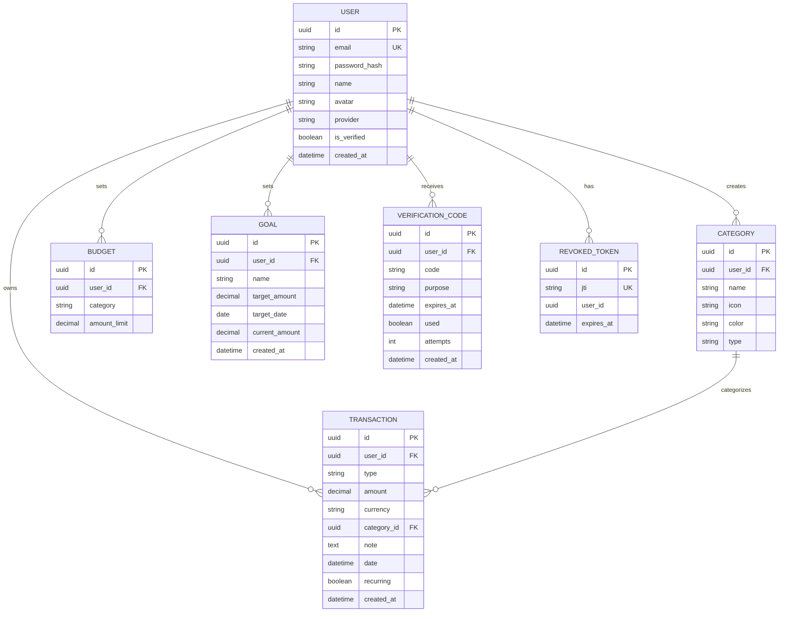

# Database Schema Documentation

This document describes the PostgreSQL database schema for the Finance Tracker application.

## Overview

The database uses SQLAlchemy 2.0 with async PostgreSQL (`asyncpg`). Tables are created via `Base.metadata.create_all()` on application startup. The project currently does not use Alembic migrations for schema changes.

## Entity Relationship Diagram



## Table Descriptions

### `user`

Stores user account information. Supports both email/password and OAuth authentication.

| Column | Type | Constraints | Nullable | Default | Description |
|--------|------|-------------|----------|---------|-------------|
| `id` | `UUID` | Primary Key | No | `uuid.uuid4()` | Unique identifier |
| `email` | `VARCHAR(255)` | Unique | No | - | User's email address |
| `password_hash` | `VARCHAR(255)` | - | Yes | `NULL` | Bcrypt hash (null for OAuth users) |
| `name` | `VARCHAR(255)` | - | Yes | `NULL` | Display name |
| `avatar` | `VARCHAR(512)` | - | Yes | `NULL` | Avatar URL |
| `provider` | `VARCHAR(50)` | - | Yes | `NULL` | OAuth provider (google, apple) |
| `is_verified` | `BOOLEAN` | - | No | `FALSE` | Email verification status |
| `created_at` | `TIMESTAMPTZ` | - | No | `now()` | Account creation timestamp |

**Relationships:**
- One-to-Many with `category` (cascade delete)
- One-to-Many with `transaction` (cascade delete)
- One-to-Many with `budget` (cascade delete)
- One-to-Many with `goal` (cascade delete)

---

### `category`

Stores income/expense categories per user. Default categories are created on signup.

| Column | Type | Constraints | Nullable | Default | Description |
|--------|------|-------------|----------|---------|-------------|
| `id` | `UUID` | Primary Key | No | `uuid.uuid4()` | Unique identifier |
| `user_id` | `UUID` | Foreign Key → `user.id` | No | - | Owner of the category |
| `name` | `VARCHAR(100)` | - | No | - | Category name (e.g., "Food") |
| `icon` | `VARCHAR(50)` | - | No | - | Ionicons icon name |
| `color` | `VARCHAR(7)` | - | No | - | Hex color code (#RRGGBB) |
| `type` | `VARCHAR(10)` | - | No | - | "income" or "expense" |

**Indexes:**
- Index on `user_id`

**Relationships:**
- Many-to-One with `user`
- One-to-Many with `transaction`

---

### `transaction`

Stores all financial transactions (income and expenses). All amounts are stored in RUB.

| Column | Type | Constraints | Nullable | Default | Description |
|--------|------|-------------|----------|---------|-------------|
| `id` | `UUID` | Primary Key | No | `uuid.uuid4()` | Unique identifier |
| `user_id` | `UUID` | Foreign Key → `user.id` | No | - | Transaction owner |
| `type` | `VARCHAR(10)` | - | No | - | "income" or "expense" |
| `amount` | `NUMERIC(12,2)` | - | No | - | Amount in RUB |
| `currency` | `VARCHAR(3)` | - | No | - | Original currency (RUB) |
| `category_id` | `UUID` | Foreign Key → `category.id` | No | - | Associated category |
| `note` | `TEXT` | - | Yes | `NULL` | Optional description |
| `date` | `TIMESTAMPTZ` | - | No | - | Transaction date |
| `recurring` | `BOOLEAN` | - | No | `FALSE` | Is recurring transaction |
| `created_at` | `TIMESTAMPTZ` | - | No | `now()` | Creation timestamp |

**Indexes:**
- Index on `user_id`
- Index on `category_id`
- Index on `date`

**Relationships:**
- Many-to-One with `user`
- Many-to-One with `category`

---

### `budget`

Stores monthly budget limits per category for each user.

| Column | Type | Constraints | Nullable | Default | Description |
|--------|------|-------------|----------|---------|-------------|
| `id` | `UUID` | Primary Key | No | `uuid.uuid4()` | Unique identifier |
| `user_id` | `UUID` | Foreign Key → `user.id` | No | - | Budget owner |
| `category` | `VARCHAR(100)` | - | No | - | Category name (not ID) |
| `amount_limit` | `NUMERIC(12,2)` | - | No | - | Budget limit amount |

**Constraints:**
- `UNIQUE(user_id, category)` - One budget per category per user

**Indexes:**
- Index on `user_id`

**Relationships:**
- Many-to-One with `user`

---

### `goal`

Stores savings goals for users.

| Column | Type | Constraints | Nullable | Default | Description |
|--------|------|-------------|----------|---------|-------------|
| `id` | `UUID` | Primary Key | No | `uuid.uuid4()` | Unique identifier |
| `user_id` | `UUID` | Foreign Key → `user.id` | No | - | Goal owner |
| `name` | `VARCHAR(200)` | - | No | - | Goal name |
| `target_amount` | `NUMERIC(12,2)` | - | No | - | Target savings amount |
| `target_date` | `DATE` | - | No | - | Target completion date |
| `current_amount` | `NUMERIC(12,2)` | - | No | `0` | Current saved amount |
| `created_at` | `TIMESTAMPTZ` | - | No | `now()` | Creation timestamp |

**Indexes:**
- Index on `user_id`

**Relationships:**
- Many-to-One with `user`

---

### `verification_code`

Stores email verification and password reset codes.

| Column | Type | Constraints | Nullable | Default | Description |
|--------|------|-------------|----------|---------|-------------|
| `id` | `UUID` | Primary Key | No | `uuid.uuid4()` | Unique identifier |
| `user_id` | `UUID` | Foreign Key → `user.id` | No | - | Code recipient |
| `code` | `VARCHAR(6)` | - | No | - | 6-digit verification code |
| `purpose` | `VARCHAR(10)` | - | No | - | "signup", "login", "reset" |
| `expires_at` | `TIMESTAMPTZ` | - | No | - | Code expiration time |
| `used` | `BOOLEAN` | - | No | `FALSE` | Has code been used |
| `attempts` | `INTEGER` | - | No | `0` | Failed attempt count |
| `created_at` | `TIMESTAMPTZ` | - | No | `now()` | Creation timestamp |

**Indexes:**
- Index on `user_id`
- Index on `code`

**Relationships:**
- Many-to-One with `user`

**Business Logic:**
- Codes expire after 10 minutes
- Max 5 failed attempts before rate limiting
- Used codes cannot be reused

---

### `revoked_token`

Stores revoked JWT tokens for logout functionality (token blacklist).

| Column | Type | Constraints | Nullable | Default | Description |
|--------|------|-------------|----------|---------|-------------|
| `id` | `UUID` | Primary Key | No | `uuid.uuid4()` | Unique identifier |
| `jti` | `VARCHAR(64)` | Unique | No | - | JWT token identifier |
| `user_id` | `UUID` | Indexed | No | - | Token owner |
| `expires_at` | `TIMESTAMPTZ` | - | No | - | Token expiration time |

**Indexes:**
- Unique index on `jti`
- Index on `user_id`

**Business Logic:**
- Expired tokens should be cleaned up periodically
- Used for immediate token revocation on logout

## Schema Change Policy

### No Migrations Approach

This project currently does **not use Alembic migrations**. Schema changes require:

1. **Backup existing data** (if any)
2. **Drop the database** or affected tables
3. **Restart the application** to recreate tables via `Base.metadata.create_all()`

### Handling Schema Changes

For development environments:

```bash
# Stop containers
docker compose down

# Remove the database volume (WARNING: destroys all data)
docker compose down -v

# Restart to recreate with new schema
docker compose up --build
```

For production environments (when applicable):

1. Export existing data:
   ```sql
   \copy (SELECT * FROM table_name) TO 'table_backup.csv' CSV HEADER;
   ```

2. Apply schema changes manually or via migration script

3. Re-import data:
   ```sql
   \copy table_name FROM 'table_backup.csv' CSV HEADER;
   ```

### Recommended Migration Strategy

If the project grows beyond simple schema changes, consider:

1. **Adding Alembic** for versioned migrations:
   ```bash
   alembic init migrations
   ```

2. **Auto-generating migrations** from model changes:
   ```bash
   alembic revision --autogenerate -m "description"
   ```

3. **Running migrations** before app startup in production

## Key Conventions

- **IDs:** All tables use UUID primary keys (generated server-side)
- **Timestamps:** All tables have `created_at` with `func.now()` default
- **Currencies:** All monetary amounts stored as `NUMERIC(12,2)` in **RUB**
- **Soft Deletes:** Not implemented; foreign keys use `CASCADE` deletes
- **Auditing:** No audit log table; consider adding if compliance requires
